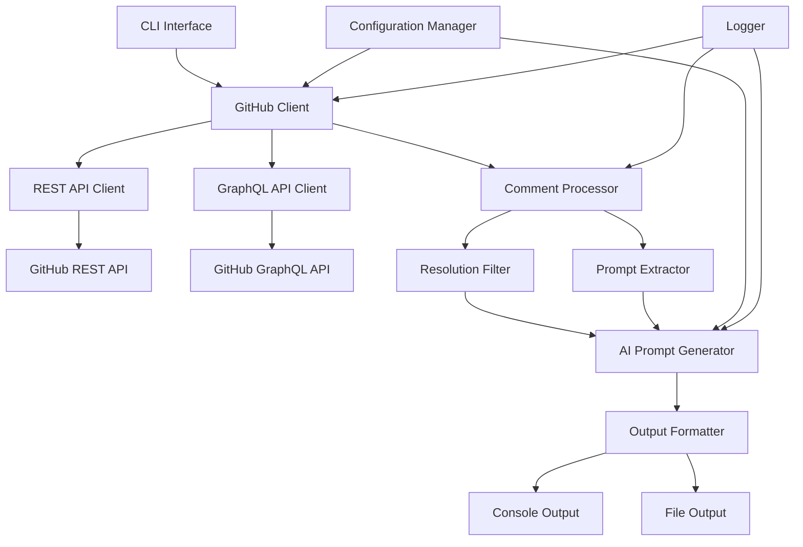

# Design Document

## Overview

The GitHub Review Prompts AI Agent tool is an enhanced Python application that extracts CodeRabbit review comments from GitHub Pull Requests and transforms them into structured, AI agent-optimized prompts. The tool leverages GitHub's GraphQL API for accurate resolution detection, implements sophisticated prompt engineering with personas, and provides comprehensive error handling and logging capabilities.

The design builds upon the existing `github_review_prompts_clean.py` script while adding significant improvements in accuracy, usability, and AI agent integration.

## Architecture

### High-Level Architecture



### Component Interaction Flow

1. **Input Processing**: CLI parses user arguments and validates GitHub PR URL
2. **Authentication**: GitHub client initializes with token-based authentication
3. **Data Retrieval**: Parallel fetching of PR comments via REST API and resolution status via GraphQL API
4. **Comment Processing**: Filter resolved comments and extract AI agent prompts
5. **Prompt Generation**: Apply persona-based formatting with context and instructions
6. **Output Generation**: Format results with markdown structure and save to file or console

## Components and Interfaces

### 1. CLI Interface (`cli.py`)

**Purpose**: Handle command-line argument parsing and user interaction

**Key Methods**:
- `parse_arguments()`: Parse and validate CLI arguments
- `validate_pr_url()`: Validate GitHub PR URL format
- `display_help()`: Show comprehensive help information

**Configuration Options**:
- `--output/-o`: Specify output file path
- `--include-resolved`: Include resolved comments in output
- `--persona`: Select AI agent persona (default: "code-reviewer")
- `--debug-comment`: Debug specific comment ID
- `--analyze-all`: Analyze all comments for resolution status
- `--format`: Output format (markdown, json)

### 2. GitHub Client (`github_client.py`)

**Purpose**: Manage all GitHub API interactions with robust error handling

**Key Classes**:

```python
class GitHubClient:
    def __init__(self, token: Optional[str] = None)
    def parse_pr_url(self, pr_url: str) -> Tuple[str, str, int]
    def get_pr_review_comments(self, owner: str, repo: str, pull_number: int) -> List[Dict]
    def get_resolved_comments_via_graphql(self, owner: str, repo: str, pull_number: int) -> Tuple[Set[int], Dict[int, str]]
    def get_comment_threads(self, owner: str, repo: str, pull_number: int) -> List[Dict]
```

**API Integration**:
- **REST API**: Retrieve review comments with pagination support
- **GraphQL API**: Fetch resolution status and complete comment bodies
- **Rate Limiting**: Implement exponential backoff and retry logic
- **Authentication**: Support both token-based and app-based authentication

### 3. Comment Processor (`comment_processor.py`)

**Purpose**: Process and filter review comments based on resolution status and content

**Key Classes**:

```python
class CommentProcessor:
    def __init__(self, github_client: GitHubClient)
    def filter_unresolved_comments(self, comments: List[Dict], resolved_ids: Set[int]) -> List[Dict]
    def extract_ai_prompts(self, comments: List[Dict]) -> List[Tuple[str, str, Dict]]
    def enrich_comment_context(self, comment: Dict) -> Dict
```

**Processing Logic**:
- Filter resolved comments using GraphQL API results
- Extract "Prompt for AI Agents" blocks from comment bodies
- Enrich comments with file context and line information
- Handle various comment formats and markdown structures

### 4. AI Prompt Generator (`prompt_generator.py`)

**Purpose**: Generate structured AI agent prompts with personas and context

**Key Classes**:

```python
class AIPromptGenerator:
    def __init__(self, persona: str = "code-reviewer")
    def generate_prompt_set(self, comments: List[Tuple[str, str, Dict]]) -> str
    def apply_persona(self, prompt: str, context: Dict) -> str
    def format_instructions(self) -> str
```

**Persona Definitions**:

```python
PERSONAS = {
    "code-reviewer": {
        "role": "Senior Software Engineer and Code Reviewer",
        "expertise": "Code quality, security, performance, and best practices",
        "approach": "Methodical analysis with focus on maintainability and correctness",
        "tone": "Professional, constructive, and detail-oriented"
    },
    "security-analyst": {
        "role": "Application Security Specialist",
        "expertise": "Security vulnerabilities, threat modeling, and secure coding practices",
        "approach": "Security-first evaluation with risk assessment",
        "tone": "Cautious, thorough, and security-focused"
    },
    "performance-optimizer": {
        "role": "Performance Engineering Specialist",
        "expertise": "Code optimization, scalability, and resource efficiency",
        "approach": "Performance-centric analysis with benchmarking mindset",
        "tone": "Analytical, metrics-driven, and optimization-focused"
    }
}
```

### 5. Output Formatter (`output_formatter.py`)

**Purpose**: Format and structure the final output for AI agents

**Key Classes**:

```python
class OutputFormatter:
    def __init__(self, format_type: str = "markdown")
    def format_prompt_list(self, prompts: List[str], metadata: Dict) -> str
    def generate_markdown_output(self, prompts: List[str], metadata: Dict) -> str
    def generate_json_output(self, prompts: List[str], metadata: Dict) -> str
    def save_to_file(self, content: str, filepath: str) -> None
```

## Data Models

### Comment Data Structure

```python
@dataclass
class ReviewComment:
    id: int
    body: str
    path: str
    line: Optional[int]
    original_line: Optional[int]
    author: str
    created_at: str
    updated_at: str
    html_url: str
    is_resolved: bool
    ai_prompt: Optional[str]
    context: Dict[str, Any]
```

### Prompt Data Structure

```python
@dataclass
class AIPrompt:
    content: str
    location: str
    file_path: str
    line_number: Optional[int]
    comment_id: int
    author: str
    priority: str  # "high", "medium", "low"
    category: str  # "security", "performance", "style", "logic"
    context: Dict[str, Any]
```

### Configuration Data Structure

```python
@dataclass
class Configuration:
    github_token: Optional[str]
    output_format: str
    persona: str
    include_resolved: bool
    debug_mode: bool
    rate_limit_delay: float
    max_retries: int
    output_file: Optional[str]
```

## Error Handling

### Error Categories and Responses

1. **Authentication Errors**:
   - Missing or invalid GitHub token
   - Insufficient permissions
   - Rate limit exceeded

2. **API Errors**:
   - Network connectivity issues
   - GitHub API service unavailable
   - Malformed API responses

3. **Data Processing Errors**:
   - Invalid PR URL format
   - Missing or corrupted comment data
   - Prompt extraction failures

4. **Output Errors**:
   - File system permission issues
   - Invalid output format
   - Encoding problems

### Error Handling Strategy

```python
class ErrorHandler:
    def handle_api_error(self, error: Exception, context: Dict) -> bool:
        """Handle API errors with retry logic"""

    def handle_processing_error(self, error: Exception, comment: Dict) -> None:
        """Handle comment processing errors gracefully"""

    def log_error(self, error: Exception, context: Dict) -> None:
        """Log errors with appropriate detail level"""
```

## Testing Strategy

### Unit Testing

1. **GitHub Client Tests**:
   - Mock API responses for various scenarios
   - Test pagination handling
   - Verify error handling and retries

2. **Comment Processor Tests**:
   - Test prompt extraction with various formats
   - Verify resolution filtering logic
   - Test comment enrichment functionality

3. **Prompt Generator Tests**:
   - Test persona application
   - Verify instruction formatting
   - Test output structure consistency

### Integration Testing

1. **End-to-End Workflow Tests**:
   - Test complete PR processing workflow
   - Verify output file generation
   - Test CLI argument handling

2. **API Integration Tests**:
   - Test against real GitHub API (with test repositories)
   - Verify GraphQL query accuracy
   - Test rate limiting behavior

### Test Data Management

```python
# Test fixtures for various comment formats
SAMPLE_COMMENTS = {
    "coderabbit_with_prompt": {
        "body": """
        <details>
        <summary>🤖 Prompt for AI Agents</summary>

        Replace hardcoded strings with constants to improve maintainability
        and reduce the risk of typos.

        </details>
        """,
        "path": "src/main.py",
        "line": 42
    },
    "resolved_comment": {
        "body": "This issue has been addressed",
        "is_resolved": True
    }
}
```

## Performance Considerations

### Optimization Strategies

1. **API Efficiency**:
   - Implement concurrent API calls where possible
   - Use GraphQL for batch operations
   - Implement intelligent caching for repeated requests

2. **Memory Management**:
   - Stream large comment datasets
   - Implement pagination for memory efficiency
   - Use generators for comment processing

3. **Rate Limiting**:
   - Implement exponential backoff
   - Respect GitHub API rate limits
   - Provide progress indicators for long operations

### Scalability Features

```python
class PerformanceOptimizer:
    def __init__(self, max_concurrent_requests: int = 5):
        self.semaphore = asyncio.Semaphore(max_concurrent_requests)

    async def fetch_comments_batch(self, pr_urls: List[str]) -> List[Dict]:
        """Fetch comments from multiple PRs concurrently"""

    def cache_api_responses(self, cache_duration: int = 300) -> None:
        """Cache API responses to reduce redundant calls"""
```

## Security Considerations

### Token Management

1. **Secure Storage**: Store GitHub tokens in environment variables or secure credential stores
2. **Scope Limitation**: Use minimal required permissions for GitHub API access
3. **Token Rotation**: Support token refresh and rotation mechanisms

### Data Privacy

1. **Sensitive Data Handling**: Avoid logging sensitive information from comments
2. **Output Sanitization**: Sanitize output to prevent information leakage
3. **Temporary File Security**: Secure handling of temporary files and cleanup

### Input Validation

```python
class SecurityValidator:
    def validate_pr_url(self, url: str) -> bool:
        """Validate PR URL to prevent injection attacks"""

    def sanitize_comment_content(self, content: str) -> str:
        """Sanitize comment content for safe processing"""

    def validate_file_path(self, path: str) -> bool:
        """Validate output file paths to prevent directory traversal"""
```

## Configuration Management

### Environment Variables

```bash
# Required
GITHUB_TOKEN=ghp_xxxxxxxxxxxxxxxxxxxx

# Optional
GITHUB_API_BASE_URL=https://api.github.com
GITHUB_GRAPHQL_URL=https://api.github.com/graphql
LOG_LEVEL=INFO
CACHE_DURATION=300
MAX_RETRIES=3
RATE_LIMIT_DELAY=1.0
```

### Configuration File Support

```yaml
# .github-review-prompts.yml
github:
  token: ${GITHUB_TOKEN}
  api_base_url: "https://api.github.com"

output:
  format: "markdown"
  default_file: "review-prompts.md"

personas:
  default: "code-reviewer"
  available: ["code-reviewer", "security-analyst", "performance-optimizer"]

processing:
  include_resolved: false
  max_concurrent_requests: 5
  cache_duration: 300
```

## Deployment and Distribution

### Package Structure

```
github-review-prompts-ai-agent/
├── src/
│   ├── github_review_prompts/
│   │   ├── __init__.py
│   │   ├── cli.py
│   │   ├── github_client.py
│   │   ├── comment_processor.py
│   │   ├── prompt_generator.py
│   │   ├── output_formatter.py
│   │   └── utils/
│   └── tests/
├── pyproject.toml
├── README.md
├── .env.example
└── docs/
```

### Installation Methods

1. **UV Package Manager**: Primary installation method using `uv add github-review-prompts-ai-agent`
2. **PyPI Distribution**: Secondary distribution via PyPI for broader compatibility
3. **Docker Container**: Containerized version for CI/CD integration

### CLI Entry Point

```python
# pyproject.toml
[project.scripts]
github-review-prompts = "github_review_prompts.cli:main"
grp = "github_review_prompts.cli:main"  # Short alias
```
