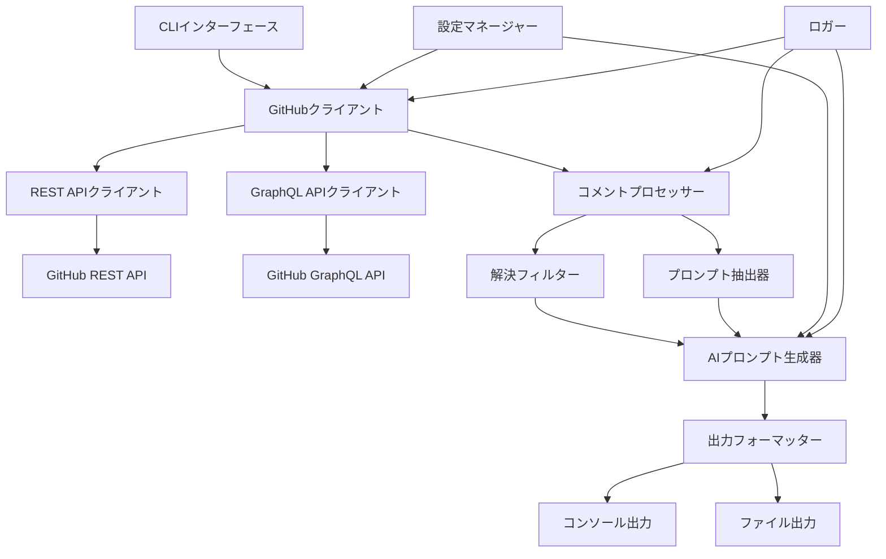

# 設計書

## 概要

GitHub Review Prompts AI Agentツールは、GitHubプルリクエストからCodeRabbitのレビューコメントを抽出し、構造化されたAIエージェント最適化プロンプトに変換する拡張Pythonアプリケーションです。このツールは、正確な解決検出のためにGitHubのGraphQL APIを活用し、ペルソナを使った高度なプロンプトエンジニアリングを実装し、包括的なエラーハンドリングとログ機能を提供します。

この設計は既存の`github_review_prompts_clean.py`スクリプトをベースに構築し、精度、使いやすさ、AIエージェント統合において大幅な改善を追加します。

## アーキテクチャ

### 高レベルアーキテクチャ



### コンポーネント相互作用フロー

1. **入力処理**: CLIがユーザー引数を解析し、GitHub PR URLを検証
2. **認証**: GitHubクライアントがトークンベース認証で初期化
3. **データ取得**: REST API経由でPRコメントを並列取得し、GraphQL API経由で解決状況を取得
4. **コメント処理**: 解決済みコメントをフィルタリングし、AIエージェントプロンプトを抽出
5. **プロンプト生成**: コンテキストと指示を含むペルソナベースのフォーマットを適用
6. **出力生成**: マークダウン構造で結果をフォーマットし、ファイルまたはコンソールに保存

## コンポーネントとインターフェース

### 1. CLIインターフェース (`cli.py`)

**目的**: コマンドライン引数の解析とユーザーインタラクションを処理

**主要メソッド**:
- `parse_arguments()`: CLI引数を解析・検証
- `validate_pr_url()`: GitHub PR URLフォーマットを検証
- `display_help()`: 包括的なヘルプ情報を表示

**設定オプション**:
- `--output/-o`: 出力ファイルパスを指定
- `--include-resolved`: 解決済みコメントを出力に含める
- `--persona`: AIエージェントペルソナを選択（デフォルト: "code-reviewer"）
- `--debug-comment`: 特定のコメントIDをデバッグ
- `--analyze-all`: すべてのコメントの解決状況を分析
- `--format`: 出力フォーマット（markdown、json）

### 2. GitHubクライアント (`github_client.py`)

**目的**: 堅牢なエラーハンドリングを備えたすべてのGitHub API相互作用を管理

**主要クラス**:

```python
class GitHubClient:
    def __init__(self, token: Optional[str] = None)
    def parse_pr_url(self, pr_url: str) -> Tuple[str, str, int]
    def get_pr_review_comments(self, owner: str, repo: str, pull_number: int) -> List[Dict]
    def get_resolved_comments_via_graphql(self, owner: str, repo: str, pull_number: int) -> Tuple[Set[int], Dict[int, str]]
    def get_comment_threads(self, owner: str, repo: str, pull_number: int) -> List[Dict]
```

**API統合**:
- **REST API**: ページネーションサポート付きでレビューコメントを取得
- **GraphQL API**: 解決状況と完全なコメント本文を取得
- **レート制限**: 指数バックオフと再試行ロジックを実装
- **認証**: トークンベースとアプリベースの両方の認証をサポート

### 3. コメントプロセッサー (`comment_processor.py`)

**目的**: 解決状況とコンテンツに基づいてレビューコメントを処理・フィルタリング

**主要クラス**:

```python
class CommentProcessor:
    def __init__(self, github_client: GitHubClient)
    def filter_unresolved_comments(self, comments: List[Dict], resolved_ids: Set[int]) -> List[Dict]
    def extract_ai_prompts(self, comments: List[Dict]) -> List[Tuple[str, str, Dict]]
    def enrich_comment_context(self, comment: Dict) -> Dict
```

**処理ロジック**:
- GraphQL APIの結果を使用して解決済みコメントをフィルタリング
- コメント本文から「Prompt for AI Agents」ブロックを抽出
- ファイルコンテキストと行情報でコメントを充実
- 様々なコメントフォーマットとマークダウン構造を処理

### 4. AIプロンプト生成器 (`prompt_generator.py`)

**目的**: ペルソナとコンテキストを含む構造化AIエージェントプロンプトを生成

**主要クラス**:

```python
class AIPromptGenerator:
    def __init__(self, persona: str = "code-reviewer")
    def generate_prompt_set(self, comments: List[Tuple[str, str, Dict]]) -> str
    def apply_persona(self, prompt: str, context: Dict) -> str
    def format_instructions(self) -> str
```

**ペルソナ定義**:

```python
PERSONAS = {
    "code-reviewer": {
        "role": "シニアソフトウェアエンジニア兼コードレビュアー",
        "expertise": "コード品質、セキュリティ、パフォーマンス、ベストプラクティス",
        "approach": "保守性と正確性に焦点を当てた体系的分析",
        "tone": "プロフェッショナル、建設的、詳細志向"
    },
    "security-analyst": {
        "role": "アプリケーションセキュリティスペシャリスト",
        "expertise": "セキュリティ脆弱性、脅威モデリング、セキュアコーディング慣行",
        "approach": "リスク評価を伴うセキュリティファーストの評価",
        "tone": "慎重、徹底的、セキュリティ重視"
    },
    "performance-optimizer": {
        "role": "パフォーマンスエンジニアリングスペシャリスト",
        "expertise": "コード最適化、スケーラビリティ、リソース効率",
        "approach": "ベンチマーキング思考によるパフォーマンス中心の分析",
        "tone": "分析的、メトリクス駆動、最適化重視"
    }
}
```

### 5. 出力フォーマッター (`output_formatter.py`)

**目的**: AIエージェント用の最終出力をフォーマット・構造化

**主要クラス**:

```python
class OutputFormatter:
    def __init__(self, format_type: str = "markdown")
    def format_prompt_list(self, prompts: List[str], metadata: Dict) -> str
    def generate_markdown_output(self, prompts: List[str], metadata: Dict) -> str
    def generate_json_output(self, prompts: List[str], metadata: Dict) -> str
    def save_to_file(self, content: str, filepath: str) -> None
```

## データモデル

### コメントデータ構造

```python
@dataclass
class ReviewComment:
    id: int
    body: str
    path: str
    line: Optional[int]
    original_line: Optional[int]
    author: str
    created_at: str
    updated_at: str
    html_url: str
    is_resolved: bool
    ai_prompt: Optional[str]
    context: Dict[str, Any]
```

### プロンプトデータ構造

```python
@dataclass
class AIPrompt:
    content: str
    location: str
    file_path: str
    line_number: Optional[int]
    comment_id: int
    author: str
    priority: str  # "high", "medium", "low"
    category: str  # "security", "performance", "style", "logic"
    context: Dict[str, Any]
```

### 設定データ構造

```python
@dataclass
class Configuration:
    github_token: Optional[str]
    output_format: str
    persona: str
    include_resolved: bool
    debug_mode: bool
    rate_limit_delay: float
    max_retries: int
    output_file: Optional[str]
```

## エラーハンドリング

### エラーカテゴリと対応

1. **認証エラー**:
   - GitHubトークンの欠如または無効
   - 権限不足
   - レート制限超過

2. **APIエラー**:
   - ネットワーク接続問題
   - GitHub APIサービス利用不可
   - 不正な形式のAPIレスポンス

3. **データ処理エラー**:
   - 無効なPR URLフォーマット
   - 欠如または破損したコメントデータ
   - プロンプト抽出失敗

4. **出力エラー**:
   - ファイルシステム権限問題
   - 無効な出力フォーマット
   - エンコーディング問題

### エラーハンドリング戦略

```python
class ErrorHandler:
    def handle_api_error(self, error: Exception, context: Dict) -> bool:
        """再試行ロジック付きでAPIエラーを処理"""

    def handle_processing_error(self, error: Exception, comment: Dict) -> None:
        """コメント処理エラーを適切に処理"""

    def log_error(self, error: Exception, context: Dict) -> None:
        """適切な詳細レベルでエラーをログ記録"""
```

## テスト戦略

### ユニットテスト

1. **GitHubクライアントテスト**:
   - 様々なシナリオでAPIレスポンスをモック
   - ページネーション処理をテスト
   - エラーハンドリングと再試行を検証

2. **コメントプロセッサーテスト**:
   - 様々なフォーマットでプロンプト抽出をテスト
   - 解決フィルタリングロジックを検証
   - コメント充実機能をテスト

3. **プロンプト生成器テスト**:
   - ペルソナ適用をテスト
   - 指示フォーマットを検証
   - 出力構造の一貫性をテスト

### 統合テスト

1. **エンドツーエンドワークフローテスト**:
   - 完全なPR処理ワークフローをテスト
   - 出力ファイル生成を検証
   - CLI引数処理をテスト

2. **API統合テスト**:
   - 実際のGitHub APIに対してテスト（テストリポジトリ使用）
   - GraphQLクエリの精度を検証
   - レート制限動作をテスト

### テストデータ管理

```python
# 様々なコメントフォーマット用のテストフィクスチャ
SAMPLE_COMMENTS = {
    "coderabbit_with_prompt": {
        "body": """
        <details>
        <summary>🤖 Prompt for AI Agents</summary>

        保守性を向上させ、タイプミスのリスクを減らすために
        ハードコードされた文字列を定数に置き換える。

        </details>
        """,
        "path": "src/main.py",
        "line": 42
    },
    "resolved_comment": {
        "body": "この問題は対処済みです",
        "is_resolved": True
    }
}
```

## パフォーマンス考慮事項

### 最適化戦略

1. **API効率**:
   - 可能な場合は並行API呼び出しを実装
   - バッチ操作にGraphQLを使用
   - 繰り返しリクエストのためのインテリジェントキャッシュを実装

2. **メモリ管理**:
   - 大きなコメントデータセットをストリーミング
   - メモリ効率のためのページネーションを実装
   - コメント処理にジェネレーターを使用

3. **レート制限**:
   - 指数バックオフを実装
   - GitHub APIレート制限を尊重
   - 長時間操作の進捗インジケーターを提供

### スケーラビリティ機能

```python
class PerformanceOptimizer:
    def __init__(self, max_concurrent_requests: int = 5):
        self.semaphore = asyncio.Semaphore(max_concurrent_requests)

    async def fetch_comments_batch(self, pr_urls: List[str]) -> List[Dict]:
        """複数のPRから並行してコメントを取得"""

    def cache_api_responses(self, cache_duration: int = 300) -> None:
        """冗長な呼び出しを減らすためにAPIレスポンスをキャッシュ"""
```

## セキュリティ考慮事項

### トークン管理

1. **セキュアストレージ**: GitHubトークンを環境変数またはセキュアな認証情報ストアに保存
2. **スコープ制限**: GitHub APIアクセスに必要最小限の権限を使用
3. **トークンローテーション**: トークンリフレッシュとローテーションメカニズムをサポート

### データプライバシー

1. **機密データ処理**: コメントからの機密情報のログ記録を回避
2. **出力サニタイゼーション**: 情報漏洩を防ぐために出力をサニタイズ
3. **一時ファイルセキュリティ**: 一時ファイルのセキュアな処理とクリーンアップ

### 入力検証

```python
class SecurityValidator:
    def validate_pr_url(self, url: str) -> bool:
        """インジェクション攻撃を防ぐためにPR URLを検証"""

    def sanitize_comment_content(self, content: str) -> str:
        """安全な処理のためにコメント内容をサニタイズ"""

    def validate_file_path(self, path: str) -> bool:
        """ディレクトリトラバーサルを防ぐために出力ファイルパスを検証"""
```

## 設定管理

### 環境変数

```bash
# 必須
GITHUB_TOKEN=ghp_xxxxxxxxxxxxxxxxxxxx

# オプション
GITHUB_API_BASE_URL=https://api.github.com
GITHUB_GRAPHQL_URL=https://api.github.com/graphql
LOG_LEVEL=INFO
CACHE_DURATION=300
MAX_RETRIES=3
RATE_LIMIT_DELAY=1.0
```

### 設定ファイルサポート

```yaml
# .github-review-prompts.yml
github:
  token: ${GITHUB_TOKEN}
  api_base_url: "https://api.github.com"

output:
  format: "markdown"
  default_file: "review-prompts.md"

personas:
  default: "code-reviewer"
  available: ["code-reviewer", "security-analyst", "performance-optimizer"]

processing:
  include_resolved: false
  max_concurrent_requests: 5
  cache_duration: 300
```

## デプロイメントと配布

### パッケージ構造

```
github-review-prompts-ai-agent/
├── src/
│   ├── github_review_prompts/
│   │   ├── __init__.py
│   │   ├── cli.py
│   │   ├── github_client.py
│   │   ├── comment_processor.py
│   │   ├── prompt_generator.py
│   │   ├── output_formatter.py
│   │   └── utils/
│   └── tests/
├── pyproject.toml
├── README.md
├── .env.example
└── docs/
```

### インストール方法

1. **UVパッケージマネージャー**: `uv add github-review-prompts-ai-agent`を使用した主要インストール方法
2. **PyPI配布**: より広い互換性のためのPyPI経由の二次配布
3. **Dockerコンテナ**: CI/CD統合用のコンテナ化バージョン

### CLIエントリーポイント

```python
# pyproject.toml
[project.scripts]
github-review-prompts = "github_review_prompts.cli:main"
grp = "github_review_prompts.cli:main"  # 短縮エイリアス
```
