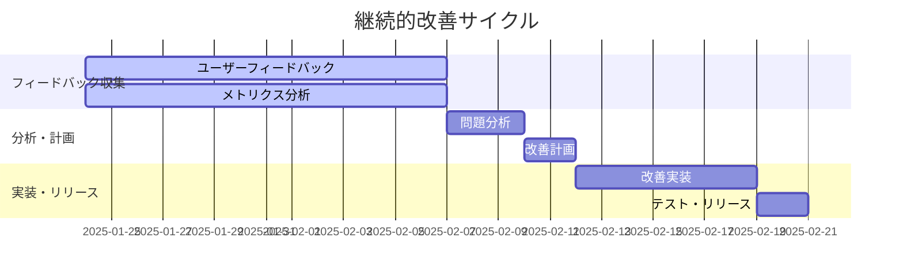

# 🔄 継続的改善ロードマップ v2.0.0+

## 🎯 **改善プロセスの概要**

v2.0.0リリース後の継続的な改善計画と、データドリブンな開発プロセス。

## 📊 **改善サイクル**

### **2週間サイクル（スプリント）**


### **改善優先度マトリックス**
| 影響度 | 実装難易度 | 優先度 | 対応時期 |
|--------|------------|--------|----------|
| 高 | 低 | 🔴 最高 | 即座 |
| 高 | 中 | 🟡 高 | 1週間以内 |
| 高 | 高 | 🟡 高 | 2週間以内 |
| 中 | 低 | 🟢 中 | 1ヶ月以内 |
| 低 | 低 | ⚪ 低 | 時間があるとき |

## 🔍 **データ収集・分析**

### **定量データ（自動収集）**
```python
# 毎日自動収集される指標
daily_metrics = {
    "usage_sessions": "セッション数",
    "avg_processing_time": "平均処理時間",
    "filtering_efficiency": "フィルタリング効率（%）",
    "reply_accuracy": "返信判定精度（%）",
    "time_prediction_accuracy": "時間予測精度（%）",
    "error_rate": "エラー発生率（%）",
    "feature_adoption": "機能採用率（%）"
}
```

### **定性データ（手動収集）**
- GitHub Issues でのフィードバック
- ユーザーインタビュー
- コミュニティディスカッション
- バグレポート分析

## 📈 **改善領域とロードマップ**

### **Phase 1: 安定化・精度向上（v2.0.x）**
**期間**: 2025年1月〜3月（3ヶ月）

#### **v2.0.1 - 緊急修正（2週間以内）**
- [ ] **フィルタリング精度向上**
  - 誤って除外されるコメントパターンの修正
  - 新しい除外パターンの追加
  - ユーザー設定可能な除外ルール

- [ ] **返信判定ロジック改善**
  - 判定ミスパターンの分析・修正
  - コンテキスト理解の向上
  - 判定理由の詳細化

#### **v2.0.2 - 機能改善（1ヶ月以内）**
- [ ] **時間予測アルゴリズム改善**
  - 実績データに基づく予測モデル調整
  - コメント複雑度による時間補正
  - ユーザー別の作業速度学習

- [ ] **UI/UX改善**
  - プロンプト可読性の向上
  - チェックリストの使いやすさ改善
  - エラーメッセージの改善

#### **v2.0.3 - パフォーマンス最適化（2ヶ月以内）**
- [ ] **処理速度向上**
  - API呼び出しの最適化
  - キャッシュ機能の追加
  - 並列処理の改善

- [ ] **メモリ使用量削減**
  - 大量コメント処理の最適化
  - メモリリーク修正
  - ガベージコレクション改善

### **Phase 2: 機能拡張（v2.1.0）**
**期間**: 2025年4月〜6月（3ヶ月）

#### **機械学習による精度向上**
- [ ] **コメント分類ML**
  - 過去データによる学習モデル構築
  - リアルタイム学習機能
  - 精度継続改善システム

- [ ] **返信テンプレート最適化**
  - プロジェクト固有のテンプレート学習
  - 成功パターンの自動抽出
  - A/Bテストによる最適化

#### **カスタマイズ機能**
- [ ] **設定ファイル対応**
  ```yaml
  # .grp-config.yml
  filtering:
    exclude_patterns:
      - "custom_pattern_1"
      - "custom_pattern_2"
    include_patterns:
      - "important_pattern"

  reply_matrix:
    custom_templates:
      technical_rejection: "カスタムテンプレート"
    time_multipliers:
      security: 1.5
      refactoring: 0.8
  ```

- [ ] **プロジェクト別設定**
  - リポジトリ固有の設定
  - チーム別のワークフロー
  - 言語・フレームワーク別最適化

#### **高度な分析機能**
- [ ] **トレンド分析**
  - コメント傾向の時系列分析
  - 品質改善トレンド
  - チーム生産性指標

- [ ] **レポート機能**
  - 週次・月次レポート自動生成
  - ダッシュボード機能
  - CSV/JSON エクスポート

### **Phase 3: AI自動化（v2.2.0）**
**期間**: 2025年7月〜9月（3ヶ月）

#### **AI自動返信機能**
- [ ] **自動返信システム**
  - 簡単な技術的質問への自動回答
  - 定型的な拒否理由の自動生成
  - 人間による確認・承認フロー

- [ ] **学習機能**
  - ユーザーの返信パターン学習
  - 成功事例の蓄積・活用
  - 継続的な精度向上

#### **リアルタイム処理**
- [ ] **Webhook対応**
  - PR作成時の自動処理
  - コメント追加時のリアルタイム分析
  - Slack/Teams通知連携

- [ ] **ストリーミング処理**
  - 大量コメントの段階的処理
  - プログレスバー表示
  - 中断・再開機能

### **Phase 4: プラットフォーム拡張（v3.0.0）**
**期間**: 2025年10月〜12月（3ヶ月）

#### **多プラットフォーム対応**
- [ ] **GitLab対応**
- [ ] **Bitbucket対応**
- [ ] **Azure DevOps対応**

#### **統合開発環境連携**
- [ ] **VS Code拡張**
- [ ] **JetBrains IDE プラグイン**
- [ ] **Vim/Neovim プラグイン**

## 📊 **成功指標（KPI）**

### **定量指標**
| 指標 | 現在値 | 目標値（3ヶ月後） | 目標値（6ヶ月後） |
|------|--------|-------------------|-------------------|
| **フィルタリング精度** | 51%削減 | 60%削減 | 70%削減 |
| **返信判定精度** | 83%正確 | 90%正確 | 95%正確 |
| **時間予測精度** | 未測定 | ±30%以内 | ±20%以内 |
| **処理速度** | 3.4秒 | 2.5秒 | 2.0秒 |
| **ユーザー満足度** | 未測定 | 4.0/5.0 | 4.5/5.0 |

### **定性指標**
- [ ] **使いやすさ**: 新規ユーザーが30分以内に使いこなせる
- [ ] **信頼性**: 週次使用でエラー遭遇率5%以下
- [ ] **有用性**: 80%以上のユーザーが「作業効率が向上した」と回答

## 🔄 **フィードバックループ**

### **データ収集**
```python
# 週次データ収集
weekly_analysis = {
    "user_feedback": collect_github_issues(),
    "usage_metrics": analyze_daily_metrics(),
    "error_patterns": analyze_error_logs(),
    "performance_data": collect_performance_metrics()
}
```

### **分析・優先度決定**
```python
# 改善項目の優先度計算
def calculate_priority(issue):
    impact_score = issue.user_count * issue.severity
    effort_score = issue.complexity * issue.time_estimate
    return impact_score / effort_score
```

### **実装・検証**
1. **プロトタイプ作成**: 小規模な改善を迅速実装
2. **A/Bテスト**: 新機能の効果測定
3. **段階的ロールアウト**: リスクを最小化した展開
4. **効果測定**: KPI改善の定量評価

## 🎯 **長期ビジョン（2026年）**

### **AI-First Code Review Assistant**
- 人間とAIの協調による効率的なコードレビュー
- プロジェクト固有の知識を学習する適応型システム
- 開発チーム全体の生産性向上プラットフォーム

### **エコシステム統合**
- CI/CDパイプラインとの完全統合
- 開発ツールチェーンの中核コンポーネント
- オープンソースコミュニティでの標準ツール化

---

**改善プロセス開始**: 2025年1月24日
**最初のマイルストーン**: v2.0.1（2025年2月7日）
**次期メジャーリリース**: v2.1.0（2025年6月30日）
**長期目標**: v3.0.0（2025年12月31日）
