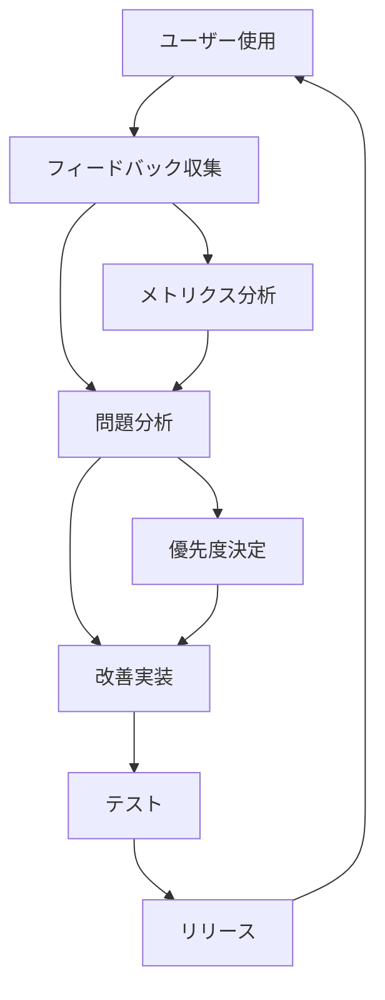

# 📋 ユーザーフィードバック収集ガイド

## 🎯 **フィードバック収集の目的**

v2.0.0の新機能について、実際のユーザー体験を収集し、継続的な改善に活用する。

## 📊 **収集したいフィードバック項目**

### 🔍 **1. スマートフィルタリングの効果**
- **質問**: 「不要なコメントの除外は適切でしたか？」
- **評価軸**:
  - ✅ 適切に除外された
  - ⚠️ 重要なコメントが除外された
  - ❌ 不要なコメントが残った
- **詳細**: どのようなコメントが誤って除外/残存したか

### 🤖 **2. 返信判定マトリックスの精度**
- **質問**: 「返信要否の自動判定は正確でしたか？」
- **評価軸**:
  - ✅ 判定が正確だった
  - ⚠️ 一部で判定ミスがあった
  - ❌ 判定が不正確だった
- **詳細**: どのような判定ミスがあったか、期待する判定は何か

### ⏱️ **3. 作業時間予測の精度**
- **質問**: 「推定作業時間は実際の作業時間と合致しましたか？」
- **評価軸**:
  - ✅ ほぼ正確（±20%以内）
  - ⚠️ やや不正確（±50%以内）
  - ❌ 大きく外れた（50%以上の差）
- **詳細**: 実際の作業時間、差が生じた理由

### 📝 **4. 生成されたプロンプトの品質**
- **質問**: 「AIエージェント用プロンプトは使いやすかったですか？」
- **評価軸**:
  - ✅ 非常に使いやすい
  - ⚠️ 改善の余地あり
  - ❌ 使いにくい
- **詳細**: 具体的な改善提案、混乱した部分

### 🚀 **5. 全体的な効率性向上**
- **質問**: 「v2.0.0により作業効率は向上しましたか？」
- **評価軸**:
  - ✅ 大幅に向上した
  - ⚠️ 少し向上した
  - ❌ 変わらない/悪化した
- **詳細**: 具体的にどの部分で効率が向上/悪化したか

## 📋 **フィードバック収集方法**

### **Method 1: GitHub Issues**
```markdown
## 🔄 v2.0.0 フィードバック

### 使用環境
- **バージョン**: v2.0.0
- **Python**: 3.13+
- **OS**: [Linux/macOS/Windows]
- **使用したPR**: [PR URL]

### 📊 評価

#### 1. スマートフィルタリング
- [ ] ✅ 適切に除外された
- [ ] ⚠️ 重要なコメントが除外された
- [ ] ❌ 不要なコメントが残った

**詳細**: [具体的な内容]

#### 2. 返信判定マトリックス
- [ ] ✅ 判定が正確だった
- [ ] ⚠️ 一部で判定ミスがあった
- [ ] ❌ 判定が不正確だった

**詳細**: [具体的な内容]

#### 3. 作業時間予測
- [ ] ✅ ほぼ正確（±20%以内）
- [ ] ⚠️ やや不正確（±50%以内）
- [ ] ❌ 大きく外れた（50%以上の差）

**実際の作業時間**: [X分]
**予測時間**: [Y分]

#### 4. プロンプト品質
- [ ] ✅ 非常に使いやすい
- [ ] ⚠️ 改善の余地あり
- [ ] ❌ 使いにくい

**改善提案**: [具体的な提案]

#### 5. 全体的効率性
- [ ] ✅ 大幅に向上した
- [ ] ⚠️ 少し向上した
- [ ] ❌ 変わらない/悪化した

**詳細**: [具体的な効果]

### 💡 追加コメント
[その他の気づき、提案、バグ報告など]
```

### **Method 2: コマンドライン フィードバック**
```bash
# 使用後にフィードバック送信
grp --feedback [PR_URL]

# 匿名フィードバック（統計のみ）
grp --anonymous-feedback [PR_URL]
```

### **Method 3: 自動メトリクス**
- 使用状況メトリクスから自動収集
- プライバシー保護された匿名データ
- 処理時間、効率性、エラー率などの定量データ

## 📈 **フィードバック分析計画**

### **週次レビュー**
- 収集されたフィードバックの分析
- 共通する問題点の特定
- 改善優先度の決定

### **月次改善**
- フィードバックに基づく機能改善
- パッチリリース（v2.0.x）の計画
- 新機能の検討

### **四半期評価**
- 大規模な機能追加の検討
- メジャーバージョンアップ（v2.1.0）の計画
- ロードマップの更新

## 🎯 **改善サイクル**



## 📞 **フィードバック送信先**

### **GitHub Issues**
- **URL**: https://github.com/yohi/github-coderabbit-comment-gettter/issues
- **ラベル**: `feedback-v2.0.0`
- **テンプレート**: 上記のMarkdownテンプレートを使用

### **直接連絡**
- **Email**: yohi@example.com
- **件名**: `[GRP v2.0.0] フィードバック`

## 🏆 **フィードバック貢献者への謝辞**

貴重なフィードバックを提供してくださったユーザーの皆様:
- 改善に直接貢献
- 将来のリリースノートで謝辞
- オープンソースコミュニティへの貢献

## 📊 **期待される改善領域**

### **短期改善（v2.0.x）**
- フィルタリング精度の向上
- 返信判定ロジックの調整
- 時間予測アルゴリズムの改善

### **中期改善（v2.1.0）**
- 機械学習による判定精度向上
- カスタマイズ可能な設定
- より詳細な分析機能

### **長期改善（v2.2.0+）**
- AI自動返信機能
- リアルタイム処理
- 多プラットフォーム対応

---

**フィードバック収集期間**: v2.0.0リリース後3ヶ月間
**目標収集数**: 50件以上のフィードバック
**改善サイクル**: 2週間毎の小改善、1ヶ月毎のパッチリリース
