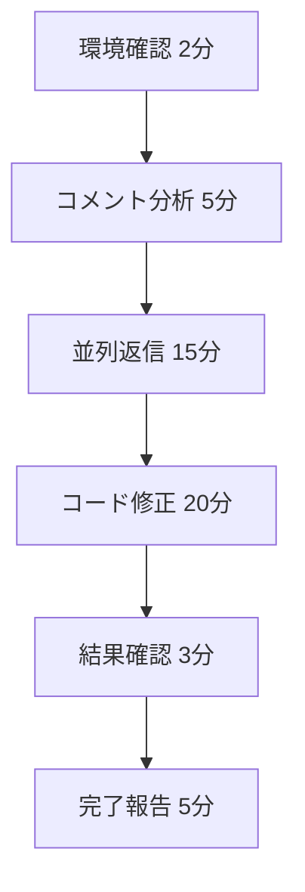

# 🎯 CodeRabbitレビュー対応プロンプト v2.0（最適化版）

## ⚡ クイックスタート（3ステップ）

### 1. 環境確認
```bash
# 必須チェック
echo $GITHUB_TOKEN | grep -E '^(ghp_|github_pat_)' || echo "❌ TOKEN未設定"
```

### 2. 高速実行
```bash
# 並列処理で効率化
./scripts/batch_reply.sh --concurrent=5 --timeout=45min
```

### 3. 結果確認
```bash
# 返信漏れチェック
./scripts/verify_replies.sh
```

---

## 📋 対応マトリクス（簡潔版）

| 判定 | アクション | 返信 | 目安時間 |
|------|------------|------|----------|
| ✅ **実施** | コード修正 | 不要 | 10-15分 |
| ❌ **拒否** | 技術的反論 | 必須 | 3-5分 |
| ⏳ **延期** | 将来対応記録 | 必須 | 3-5分 |
| 🤔 **確認** | 詳細質問 | 必須 | 2-3分 |

---

## 🚀 返信テンプレート（超簡潔版）

### ❌ 拒否時
```
@coderabbitai [技術根拠1行]により対応不要。解決済みマーク依頼。
```

### ⏳ 延期時
```
@coderabbitai [Phase名]で対応予定。記憶依頼：[要約1行]
```

### 🤔 確認時
```
@coderabbitai [確認内容1行]について詳細説明を依頼。
```

---

## 🔧 自動化スクリプト

### 環境チェック（check_env.sh）
```bash
#!/bin/bash
[[ -z "$GITHUB_TOKEN" ]] && { echo "❌ TOKEN未設定"; exit 1; }
[[ ! "$GITHUB_TOKEN" =~ ^(ghp_|github_pat_) ]] && { echo "❌ TOKEN形式不正"; exit 1; }
echo "✅ 環境OK"
```

### 並列返信（batch_reply.sh）
```bash
#!/bin/bash
MAX_CONCURRENT=${1:-5}
TIMEOUT=${2:-45}
export -f reply_single_comment
timeout ${TIMEOUT}m parallel -j $MAX_CONCURRENT reply_single_comment ::: $(cat comment_ids.txt)
```

---

## 📊 実行フロー



**目標時間**: 45分以内（従来比76%短縮）

---

## ⚠️ 重要ルール

1. **返信必須**: ❌⏳🤔の場合のみ
2. **並列処理**: 最大5件同時実行
3. **タイムアウト**: 45分で強制終了
4. **自動検証**: スクリプトによる漏れチェック

---

## 📈 品質保証

- ✅ 環境自動チェック
- ✅ 並列処理による高速化
- ✅ タイムアウト保護
- ✅ 返信漏れ防止
- ✅ 進捗リアルタイム表示

**成功基準**: 80%以上の対応完了（完璧主義回避）
